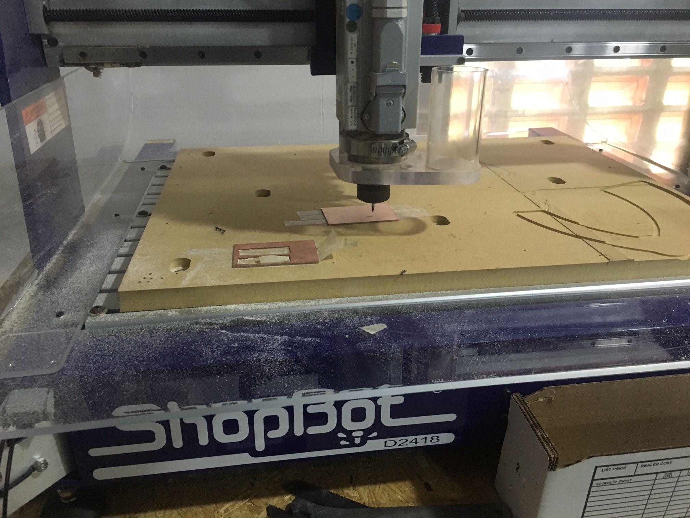

  [ABOUT ME](https://github.com/zayedshafank/zayedshafank.github.io/blob/master/ABOUT%20ME)

[ZAYED](.gitignore)

## ZAYED SHAFAN KALAPPADAN       

# WHO AM I 

I am ZAYED SHAFAN K, btech civil engineering student MESCE,
intrested in fabrication and solving puzzils. https://youtu.be/8dYM2rlqkW0

<video src="How to solve cube by ZAYEDSHAFAN.K.mp4" width="320" height="200" controls preload></video>

  
  
  
# CONTACT ME 
+919207169999
e mail me - zayed.sk9gmail.com

# MESCE FAB Training

# DAY1

Inroduction of fab lab

# DAY2

Wide information about 3d printer
and teach how to use it.

3d printer

  

  
  
  
  # DAY 3
  
  
We designed and printed 3d small sample object.

<video src="Video.MOV" width="320" height="200" controls preload></video>

# DAY 4

Detail study about various machines LASER,VINYL CUTTER,CNC

# LASER

Step 1: Creating an Image / Uploading an Image

You will first want to open Adobe Illustrator and click file . . new. 

From there you will decide on a title for the image as well as how big the paper size is.  An art board will be created showing the cutting area. 

Once you have the art board, you just have to draw out the image to be cut.

If you have already created an image on Auto Cad or any other design software, you will want to click on file . . open.

A window will pop up asking if you want to scale the image.  You will want to know the dimensions of  the paper and what the units represent on your CAD drawing.  Scale your image accordingly.

Step 2: Color Scheme / Line Weight

Once you have your image on the screen you will want to decide if you want to engrave this image or cut it out completely .

This is when you have to decide which color represents a raster (engrave) and what color is for a vector (full cut).

To set your color scheme select file . . print.  Once on this page, select setup and then select preferences.

This page will start you on a tab called General.  You can make sure the page size is correct for your paper.

Then move over to the Color Mapping tab. From here you can change whether a color is for raster or vector cutting. Shown below is a color scheme with red as raster and black as the vector color. You have to make sure the color mapping box has been checked so it knows to refer to the different settings for different colors. 

For engraving, fill in the entire area you want engraved. Alternatively for vector cutting, you just need an outline of where to cut. 

You will also want the thickness of the vector lines that you want cut set at 0.001" .  This is the best quality for cutting out images.  You can see in the third image below where to change the thickness.  The forth image shows what the lines look like after being changed to a thickness of 0.001".

Step 3: Print Setup

For the most part the paper size and images should be good to go.  Although, you always want to double check your color scheme and paper size. 

To set your print setup, select file . . print.  Once on this page, select setup and then select preferences.

Under the general tab you will want to set the power and speed for both the raster and vector settings. The raster setting shown here is to engrave a 1/8" sheet about half way through the acrylic.  Check the manual for engraving on different materials or for different depths.  The vector settings shown here are for cutting completely through the acrylic. 

Step 4: Setting Up to Begin Cutting

Before you send the image to the printer, you will want to make sure the compressed air and exhaust fan are turned on in the fume hood. 

To turn the air on, just turn the blue handle 90 degrees until you hear the air flow.

Then to turn the exhaust fan on, just pull the red switch toward you.

Also, you will want to make sure that the acrylic is placed properly on pegs and the glass top is closed.  The pegs should be positioned to adequately support the medium being used so that it doesn't move around during lasering.

Once you hit print it will send the job over to the Epilog but it will not start cutting until you hit the green go button on the front of the machine. 

Step 5: the Printing Begins

Once the printing begins never walk away from the machine while it is cutting your image. The laser cutter can catch fire and you will want to be there to stop the machine and put the fire out quickly. 

# MY ASSIGNMENT

# VINYL CUTTING

Step 1: Finding an Image.

Find or make an image that you want to make into a sticker. You can create an image with Open Office Draw, or Gimp. Other programs can work fine.Your image should be black and white with no gray for best results.

 

Save the image as a JPEG The software running the cutter likes to have a jpeg, Scaleable Vector Graphic (.SVG) can work fine as well.

You could also open with a preffered browser and copy and paste into the cutting program, which is in this case, CutStudio.

Step 2: Using the Software.
design ur print.

Open Cut Studio, the software bundled with the cutter.

Import your image. It should show up as a grayed out picture.

Right click on the image, then choose Trace Image Outline

A dialog box will come up, you can adjust the accuracy of the cuts by adjusting the values.

You will see an outline of your image laid on top of the picture.

Click the Move button on the upper right to put the outline in the bottom right of the design area.

Next, delete the picture.

Right click on the picture and choose 'Properties'

There are three tabs. For size, choose the size that will fit your sample piece of vinyl. The cutter measures in millimeters.

If you need to rotate the image to fit the sticker size, you can do that in the 'Rotation' field.

If you haven't already,  to put a box, oval or circle around your image to make it easier to separate later.

Step 3: Loading the Vinyl

Load the sample piece of vinyl into the machine. 
On the left side in the front and back are two LED 'eyes'. These are infared emitters and receivers which sense the presence of the vinyl. You have to position the vinyl so that it will cover these sensors. You also have to position the pressure rollers over the vinyl to make sure it will be able to handle the material. On the panel above the rollers, there are several white lines. The rollers must be positioned on these white lines or the machine wont run. Make sure the vinyl is running straight, or it may slip out from under the rollers. Flip the pressure lever to make the rollers press down, holding the vinyl between the rollers and the pressure bar. 

step 4:

Check the display. It shoulde say Sheer unloaded intil you engage the pressure roller. Then you will need to use the down arrow to tell the machine you have loaded a piece or a roll. If you choose piece, the cutter head will move sideways, measure the space between the rollers, then it will move the piece out, the back in, then to its original position. This process used the 'eyes' to measure the height of the piece. you then should be able to see the readout on the display of the pieces measurements. 

Step 5: Cutting

Press the Cut button on the icon bar.
The cutter head should then move side to side and the vinyl should move back and forth.

When the design is cut, you can use the arrow keys to move the vinyl out of the machine.

There is a groove on the front of the machine. Use a razor knife in this groove to cut the piece off. If there is enough material left, you can leave it in the machine for the next person.

# DAY 5

# 3D PRINTER

3d1.JPG

STEP 1 Preparation of a model for printing

1. Prepare a 3D model and convert it into one of the following formats
using any of the available 3D-modelling software (Siemens NX, AutoCad, Inventor,
Rhino, etc.):
.STL .OBJ .DAE. .AMF
2. Load the suitably converted 3D model file into Cura1 via the “Load”
button. Adjust the model’s scale and position in a virtual space of the Ultimaker 2+
presented in Cura.
*If necessary for the construction, don’t forget to utilize “Support Structure”.
Customize the nozzle / material / speed settings in the upper left
corner of the Cura Software.
Wait for the software to process the model and the settings.
After a while you will get the result with “Time”, “Length of plastic
wire”, “Mass of plastic” specified. If the results are satisfying, proceed
with saving.
Save the model to the SD-card (from Ultimaker 2+) by pushing button.

STEP 2 Printing the model in Ultimaker 2+

1. Insert the SD-card with the saved 3D-model from the Cura
software (in G-code format) into the slot on the Ultimaker 2+.
2. Using the LCD (display) Check if the material installed corresponds with
the specified in the Cura software. Use the following steps:
MATERIAL – SETTINGS
3. If necessary2
, using the LCD level the build-plate with the following
steps:
MAINTENANCE – BUILD-PLATE
…follow the described on the display procedures.
4. Go to the PRINT section using the LCD. Find your model. Push the
button on the disk and start printing3
.
5. Printing takes time. Check your model constantly, and never touch the
model or the machine while printing.
6. Detach the printed model from the glass-plate.
7. Clean the printed model from the supports, excesses of the material, etc.

# MY ASSIGNMENT

# DAY 6

# CNC/PCB CUTTING

Open or Import the vector design
Select the regions to VCarve or machine
Specify the tool details and calculate tool paths
Preview the job in any material
Save the CNC code (save the tool paths)

.

# DAY 7
# MOULDING

# SCREEN PRINTING

[Link](More images)
